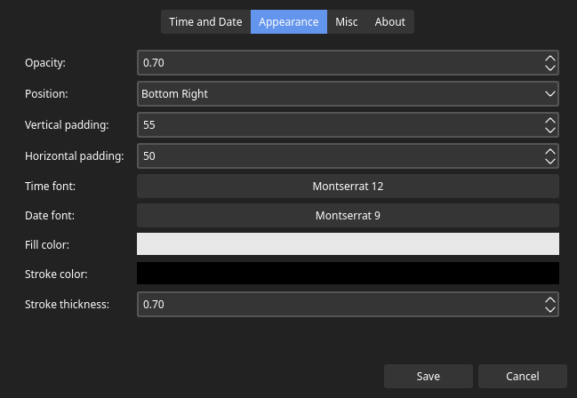

<p align="center">
    
    <p align="center" style="display:flex;justify-content:space-between;">
		<a href="https://github.com/kostoskistefan/hoverclock/releases">
            
        </a>
        <a href="https://aur.archlinux.org/packages/hoverclock-appimage/">
            
        </a>
	</p>
</p>

# Hoverclock 

Hoverclock is a simple, yet customizable floating clock for Linux created with QT. 


## Table of contents
* [General info](#general-info)
* [Technologies](#technologies)
* [Quick note](#quick-note)
* [Installation](#installation)
  * [Arch based distro users](#arch-based-distro-users)
  * [Other distros](#other-distros)
* [Optional dependencies](#optional-dependencies)
  * [AppImageLauncher](#appimagelauncher)
  * [X Server](#x-server)
  * [Font](#font)
* [Configuration](#configuration)
* [Building and deploying](#building-and-deploying)
  * [Build dependencies](#build-dependencies)
* [Known issues](#known-issues)
* [Future work](#future-work)
* [Getting help](#getting-help)
* [Getting involved](#getting-involved)
  * [Using the issue tracker](#using-the-issue-tracker)
  * [Changing the code-base](#changing-the-code-base)
    * [Code conventions](#code-conventions)

## General info
The main incentive for this project is having desktop panels that automatically hide, but still being able to see the time and date without moving your mouse to unhide the panel.

## Technologies
 * C++
 * QT 5.12 with QT Creator
 * [LinuxDeploy](https://github.com/linuxdeploy/linuxdeploy)

## Quick note
This project has only been tested on Arch Linux with KDE Plasma.

## Usage
### Arch based distro users
You can download and install the app from the [AUR package](https://aur.archlinux.org/packages/hoverclock-appimage/).

### Other distros
Head on over to the [releases section](https://github.com/kostoskistefan/hoverclock/releases) of this repository and download the latest AppImage file. 

Make the file executable by running `chmod u+x Hoverclock-x86_64.AppImage`.

Double-click to run it or run it from a terminal using `/path/to/the/downloaded/file/Hoverclock-x86_64.AppImage`.

## Optional dependencies
### AppImageLauncher
If you are using an Arch based Linux distribution and you want to integrate this application in your system, a simple solution is to install [AppImageLauncher](https://aur.archlinux.org/packages/appimagelauncher/) from the AUR. 

After installing it, double clicking the AppImage file will open up the AppImageLauncher and will offer an option to `Integrate and run`.

### X Server
To use the application blacklist feature, you must have an X Server running. If you are using Wayland, make sure you have XWayland installed.

To support different systems, the blacklist feature is disabled by default and you need to enable it in the Visibility tab of the settings dialog to use it.

### Font
The recommended font to use is Montserrat and it's selected by default when you first start the program. 

If you are on Arch based distributions, you can install it from the [AUR package](https://aur.archlinux.org/packages/montserrat-ttf/).

Of course, if you wish to use a different font, you can. Change it in the settings dialog in the Appearance tab.

## Configuration
As stated previously, Hoverclock is designed to be customizable. 

Left clicking the system tray icon will toggle the visibility of the clock, while right clicking brings up a menu from which you can access the application settings.





## Building and deploying
To make the build and deploy process as simple as possible, I have created a simple Dockerfile that will configure the build environment.

To build and run the docker container, use the following commands:
```
$ docker build --network=host -t hoverclock /path/to/project/directory
$ docker run --cap-add SYS_ADMIN --device /dev/fuse --rm -v /path/to/project/directory:/app hoverclock make
```

When it finished building, you should have an AppImage in the project directory.

### Build dependencies
To allow running AppImages inside the docker container, you must have FUSE installed on your host system and load the kernel module (before running docker) with the following command: `modprobe fuse`.

After doing so, you can proceed to run the docker container with the above mentioned commands.

## Known issues
 * You must have at least one panel with a system tray to access the settings menu and configure Hoverclock to your liking.
 * The font and color picker do not fully use the custom theme resource.

## Future work
- [ ] Add terminal support to open and configure settings
- [x] Add support for multi-monitor setups
- [x] Add a feature that allows you to specify programs in which you want to hide the clock.
- [ ] Add Light and Dark mode icon support

## Getting help
If you have questions, concerns, bug reports, etc, please file an issue in this repository's [Issue Tracker](https://github.com/kostoskistefan/hoverclock/issues).

## Getting involved
There are two primary ways to help:

* Using the issue tracker, and
* Changing the code-base.

### Using the issue tracker
Use the [issue tracker](https://github.com/kostoskistefan/hoverclock/issues) to suggest feature requests, report bugs, and ask questions. Any feedback is greatly appreciated.

### Changing the code-base
If you want to directly affect the code, you should fork this repository, make changes on your own fork, then submit a pull request. 

#### Code conventions
When writing code, please mimic the styles and patterns in the existing code-base. That means, using camelCase variable names, self-explanatory variable names, all new files should use the underscore notation, use a #define guard for header files, etc.

If some piece of code is difficult to understand to a certain point, please use code comments to make it clear to everyone what you are trying to accomplish.
